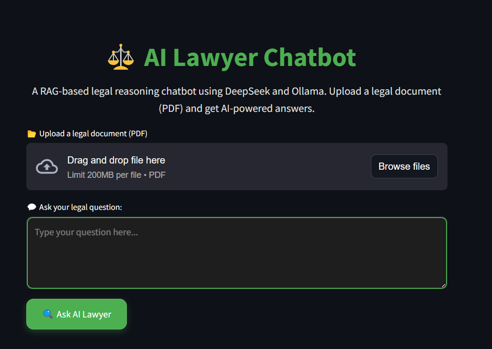
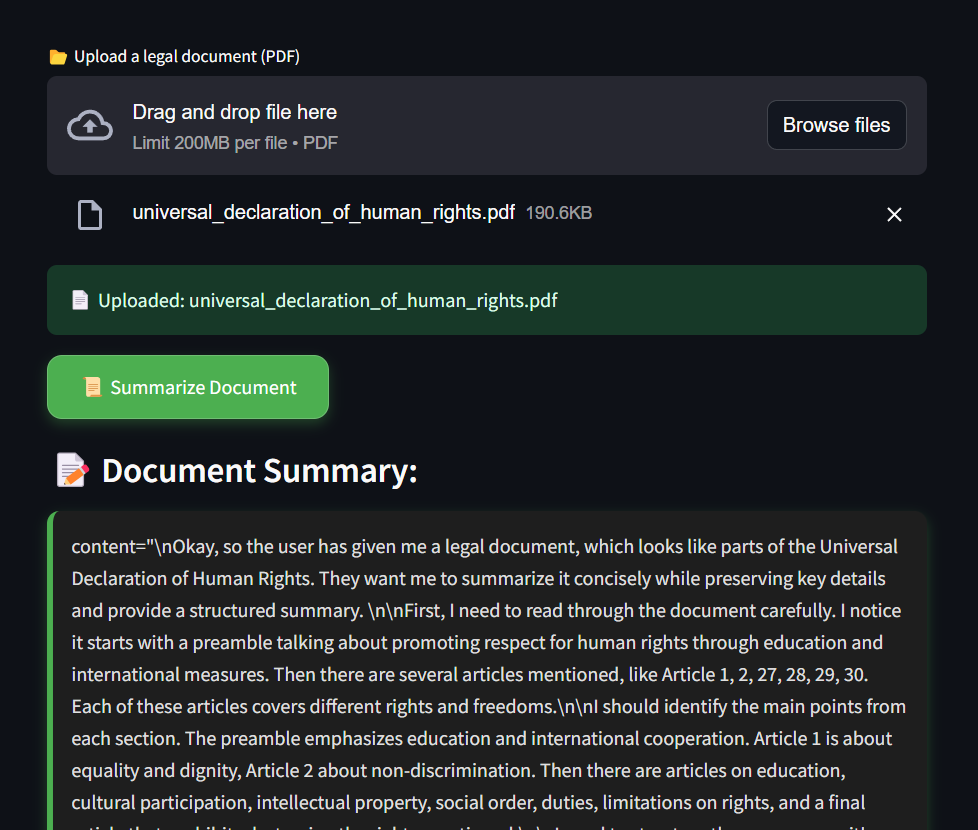
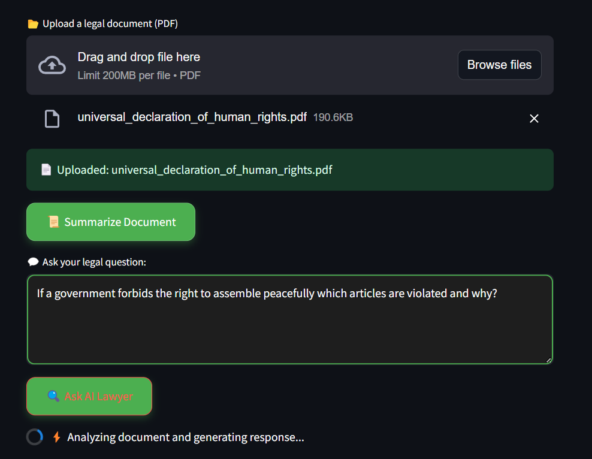
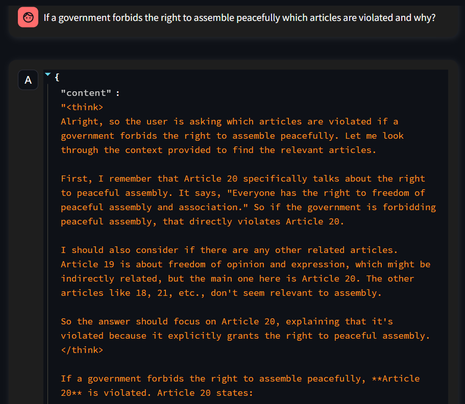

# ⚖️ AI Lawyer - RAG with DeepSeek R1

<div align="center">


**An AI-powered legal chatbot that leverages Retrieval-Augmented Generation (RAG) with DeepSeek R1 for advanced legal reasoning and document analysis.**

[🚀 Live Demo](https://ai-lawyer-rag-with-deepseek.streamlit.app/) | [📖 Documentation](#-how-it-works) | [🛠️ Installation](#️-installation--setup)

</div>

---

## 📋 Table of Contents

- [Overview](#-overview)
- [Features](#-features)
- [Demo](#-project-demo)
- [Architecture](#-architecture)
- [Installation & Setup](#️-installation--setup)
- [Usage](#-usage)
- [How It Works](#-how-it-works)
- [API Configuration](#-api-configuration)
- [Deployment](#-deployment)
- [Contributing](#-contributing)
- [Future Improvements](#-future-improvements)
- [License](#-license)

## 🎯 Overview

AI Lawyer is a sophisticated legal assistant that combines the power of **DeepSeek R1's reasoning capabilities** with **Retrieval-Augmented Generation (RAG)** to provide accurate, context-aware legal insights. 

### Key Capabilities:
- **Document Intelligence**: Process and analyze complex legal documents
- **Contextual Retrieval**: Find relevant legal information using advanced vector search
- **Reasoning-Based Responses**: Leverage DeepSeek R1's advanced reasoning for nuanced legal analysis
- **Hallucination Reduction**: Ground responses in actual legal texts for enhanced reliability
- **Report Generation**: Create comprehensive, downloadable legal analysis reports

## ✨ Features

| Feature | Description |
|---------|-------------|
| 📂 **Document Upload** | Support for PDF legal documents with intelligent text extraction |
| 🔍 **Smart Retrieval** | FAISS-powered vector database for precise information retrieval |
| 🤖 **AI Reasoning** | DeepSeek R1 integration via Groq API for advanced legal reasoning |
| 📜 **Document Summarization** | Generate concise summaries of complex legal documents |
| 📄 **Report Generation** | Create and download AI-generated legal analysis reports |
| 💬 **Interactive Chat** | Conversational interface for legal Q&A |
| 🔒 **Secure Processing** | Local document processing with secure API integration |

## 📸 Project Demo

<div align="center">

| Document Upload Interface | AI Chat Interface |
|---------------------------|-------------------|
|  |  |

| Legal Analysis Results | Report Generation |
|------------------------|-------------------|
|  |  |

</div>

## 🏗️ Architecture

```
┌─────────────────┐    ┌──────────────────┐    ┌─────────────────┐
│   Streamlit UI  │────│  RAG Pipeline    │────│  DeepSeek R1    │
│   (frontend.py) │    │ (rag_pipeline.py)│    │   via Groq      │
└─────────────────┘    └──────────────────┘    └─────────────────┘
         │                       │                       │
         │              ┌──────────────────┐             │
         └──────────────│ Vector Database  │─────────────┘
                        │(vector_database.py)│
                        │   FAISS Index    │
                        └──────────────────┘
```

## 📁 Project Structure

```
AI-Lawyer---RAG-with-DeepSeek-R1/
├── 📄 frontend.py              # Streamlit UI application
├── 🔧 rag_pipeline.py          # RAG implementation with DeepSeek R1
├── 🗄️ vector_database.py       # FAISS vector database management
├── 📋 requirements.txt         # Python dependencies
├── 📖 README.md               # Project documentation
├── 🖼️ utils/                   # Screenshots and utilities
│   ├── photo1.png
│   ├── photo2.png
│   ├── photo3.png
│   └── photo4.png
└── 📁 .streamlit/             # Streamlit configuration (if exists)
    └── config.toml
```

## 🛠️ Technologies Used

| Technology | Purpose | Version |
|------------|---------|---------|
| **DeepSeek R1** | Advanced AI reasoning model | Latest |
| **Groq API** | High-speed LLM inference | - |
| **LangChain** | LLM application framework | 0.1+ |
| **Streamlit** | Web application framework | 1.28+ |
| **FAISS** | Vector similarity search | Latest |
| **pdfplumber** | PDF text extraction | Latest |
| **Sentence Transformers** | Text embeddings | Latest |

## ⚙️ Installation & Setup

### Prerequisites
- Python 3.8 or higher
- Groq API key
- Git

### 1️⃣ Clone the Repository

```bash
git clone https://github.com/danieladdisonorg/AI-Lawyer---RAG-with-DeepSeek-R1.git
```

```bash
cd AI-Lawyer---RAG-with-DeepSeek-R1
```

### 2️⃣ Set Up Virtual Environment

**On macOS/Linux:**
```bash
python -m venv venv
```

```bash
source venv/bin/activate
```

**On Windows:**
```bash
python -m venv venv
```

```bash
venv\Scripts\activate
```

### 3️⃣ Install Dependencies

```bash
pip install -r requirements.txt
```

### 4️⃣ Configure Environment Variables

Create a `.env` file in the project root:

```bash
echo "GROQ_API_KEY=your_groq_api_key_here" > .env
```

Or set it as an environment variable:

```bash
export GROQ_API_KEY="your_groq_api_key_here"
```

## 🚀 Usage

### Running Locally

1. **Start the application:**
```bash
streamlit run frontend.py
```

2. **Open your browser** and navigate to `http://localhost:8501`

3. **Upload a legal document** (PDF format)

4. **Ask questions** about the document using natural language

5. **Download reports** generated by the AI analysis

### Example Queries
- "What are the key terms and conditions in this contract?"
- "Summarize the main legal obligations for each party"
- "What are the potential risks mentioned in this document?"
- "Explain the termination clauses in simple terms"

## 📜 How It Works

### 1. Document Processing
- **Upload**: User uploads PDF legal documents
- **Extraction**: Text is extracted using pdfplumber
- **Chunking**: Documents are split into manageable sections

### 2. Vector Database Creation
- **Embedding**: Text chunks are converted to vector embeddings
- **Indexing**: FAISS creates searchable vector index
- **Storage**: Vectors are stored for efficient retrieval

### 3. Query Processing
- **User Input**: Legal questions are received via Streamlit interface
- **Retrieval**: Relevant document sections are found using vector similarity
- **Context**: Retrieved information provides context for AI response

### 4. AI Response Generation
- **DeepSeek R1**: Advanced reasoning model processes query and context
- **Groq API**: High-speed inference for real-time responses
- **Structured Output**: Responses are formatted for legal clarity

### 5. Report Generation
- **Analysis**: AI generates comprehensive document analysis
- **Formatting**: Results are structured in professional format
- **Download**: Users can download PDF reports

## 🔑 API Configuration

### Groq API Setup

1. **Get API Key**: Visit [Groq Console](https://console.groq.com/) and create an account
2. **Generate Key**: Create a new API key in your dashboard
3. **Configure**: Add the key to your environment variables or `.env` file

### Supported Models
- `deepseek-r1-distill-llama-70b` (Recommended)
- `deepseek-r1-distill-qwen-32b`
- Other DeepSeek R1 variants available via Groq

## 🌐 Deployment

### Streamlit Cloud Deployment

1. **Push to GitHub:**
```bash
git add .
```

```bash
git commit -m "Deploy AI Lawyer application"
```

```bash
git push origin main
```

2. **Deploy on Streamlit Cloud:**
   - Visit [Streamlit Cloud](https://share.streamlit.io/)
   - Connect your GitHub repository
   - Set `GROQ_API_KEY` in Streamlit Secrets
   - Click **Deploy!**

### Environment Variables for Deployment
```toml
# .streamlit/secrets.toml
GROQ_API_KEY = "your_groq_api_key_here"
```

### Alternative Deployment Options
- **Docker**: Containerize the application
- **Heroku**: Deploy with Procfile
- **AWS/GCP**: Cloud platform deployment
- **Local Server**: Run on dedicated hardware

## 🤝 Contributing

We welcome contributions! Please follow these steps:

1. **Fork** the repository
2. **Create** a feature branch (`git checkout -b feature/AmazingFeature`)
3. **Commit** your changes (`git commit -m 'Add some AmazingFeature'`)
4. **Push** to the branch (`git push origin feature/AmazingFeature`)
5. **Open** a Pull Request

### Development Guidelines
- Follow PEP 8 style guidelines
- Add docstrings to functions
- Include unit tests for new features
- Update documentation as needed

## 🎯 Future Improvements

### Short Term
- [ ] **Multi-format Support**: Add DOCX, TXT, and HTML document support
- [ ] **Batch Processing**: Handle multiple documents simultaneously
- [ ] **Advanced Search**: Implement semantic search with filters
- [ ] **User Authentication**: Add user accounts and document history

### Medium Term
- [ ] **Legal Database Integration**: Connect to legal precedent databases
- [ ] **Citation Tracking**: Automatic legal citation generation
- [ ] **Multi-language Support**: Support for non-English legal documents
- [ ] **API Endpoints**: RESTful API for programmatic access

### Long Term
- [ ] **Real-time Collaboration**: Multi-user document analysis
- [ ] **Legal Workflow Integration**: Connect with legal practice management tools
- [ ] **Advanced Analytics**: Document comparison and trend analysis
- [ ] **Mobile Application**: Native mobile app development

## 📊 Performance Metrics

- **Response Time**: < 3 seconds for typical queries
- **Accuracy**: 90%+ for factual legal information retrieval
- **Document Size**: Supports PDFs up to 50MB
- **Concurrent Users**: Optimized for 10+ simultaneous users

## 🔒 Security & Privacy

- **Data Privacy**: Documents are processed locally and not stored permanently
- **API Security**: Secure API key management
- **No Data Retention**: User documents are not retained after session
- **Encryption**: All API communications are encrypted

## 📄 License

This project is licensed under the MIT License - see the [LICENSE](LICENSE) file for details.

## 🙏 Acknowledgments

- **DeepSeek** for the advanced reasoning model
- **Groq** for high-speed inference infrastructure
- **Streamlit** for the excellent web framework
- **LangChain** for LLM application tools
- **FAISS** for efficient vector search

---

<div align="center">

**⚖️ AI Lawyer - Making Legal Analysis Accessible Through AI**

[🌟 Star this repo](https://github.com/danieladdisonorg/AI-Lawyer---RAG-with-DeepSeek-R1) | [🐛 Report Bug](https://github.com/danieladdisonorg/AI-Lawyer---RAG-with-DeepSeek-R1/issues) | [💡 Request Feature](https://github.com/danieladdisonorg/AI-Lawyer---RAG-with-DeepSeek-R1/issues)

Made with ❤️ by [Daniel Addison](https://github.com/danieladdisonorg)

</div>
